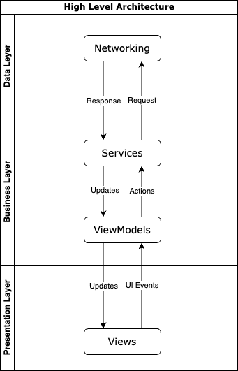

iOS application consuming DataUSA, using SwiftUI, MVVM-C, Combine

# Architecture
MVVM-C + Combine architecture

## Data Access Layer

Data Access Layer includes `APIServiceTypeAPIRequestType` protocol and `APIRequestType` protocol to standardise the networking logic. They provide asynchronous APIs for networking. It pass data as a `Publisher` from `Combine` framework. 

## Business Logic Layer

Business Logic Layer includes `Services` and `ViewModels`. 

In the `Services` layer we have `DataUSAAPIService` that receives requests to fetch data from DataUSA API.

`DataUSAAPIService` comforms to `APIServiceType` protocol. This way gives the ability to use dependency injection to inject `MockDataUSAAPIService` in `ViewModel` in unit tests.

`ViewModels` work between `Views` and `Services`, encapsulating business logic to the `Views`. 

 Also `ViewModels` request and subscrive to process whatever is passed from upstream publishers (`Services`)

## Presentation Layer

Presentation Layer is represented by `Views`.

Inside `Views` the `ViewModels` are marked as `@ObservedObject` such that SwiftUI is able to monitor `ViewModels` for updates and redraw the UI.

# Screens

The application works on iPhone and iPad devices, supporting portrait and landscape orientations. 

## DataUSA

In the main screen the user can select between state or nation information.

## Population by State

To show the information about state population the app uses a `Grid` layout, with a state name and corresponding population.

The information is filtered by year, pre selecting the first available data `year`. To access to different years the user should select the dropdown element and pick a different year.

It is also possible to order elements by `population` instead of the default order by `name`

## Population by Nation

To show the information about nation population the app uses a `List` layout, with a nation and corresponding population.

It is also possible to order elements by `population` instead of the default order by `name`

## Progress and error handling

